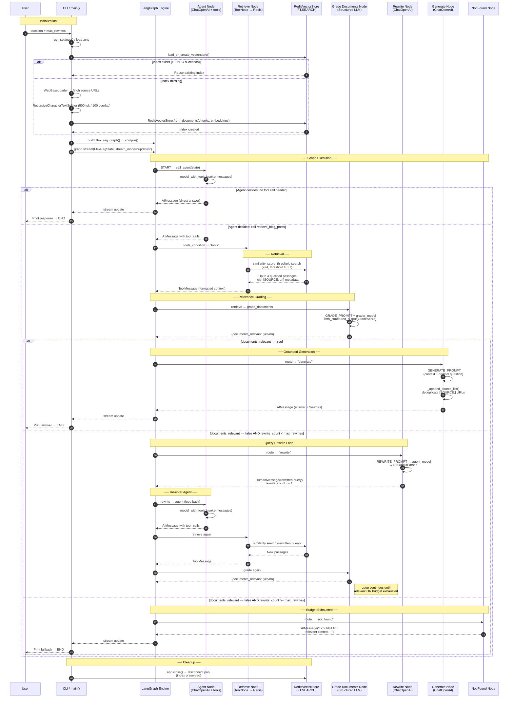

# Flex RAG — End-to-End Request Flow

```mermaid
sequenceDiagram
    autonumber

    participant User
    participant CLI as CLI / main()
    participant Graph as LangGraph Engine
    participant Agent as Agent Node<br/>(ChatOpenAI + tools)
    participant Retriever as Retrieve Node<br/>(ToolNode → Redis)
    participant Redis as RedisVectorStore<br/>(FT.SEARCH)
    participant Grader as Grade Documents Node<br/>(Structured LLM)
    participant Rewriter as Rewrite Node<br/>(ChatOpenAI)
    participant Generator as Generate Node<br/>(ChatOpenAI)
    participant Fallback as Not Found Node

    Note over User,CLI: ── Initialization ──

    User ->> CLI: question + max_rewrites
    CLI ->> CLI: get_settings() / load .env
    CLI ->> Redis: load_or_create_vectorstore()

    alt Index exists (FT.INFO succeeds)
        Redis -->> CLI: Reuse existing index
    else Index missing
        CLI ->> CLI: WebBaseLoader → fetch source URLs
        CLI ->> CLI: RecursiveCharacterTextSplitter (500 tok / 100 overlap)
        CLI ->> Redis: RedisVectorStore.from_documents(chunks, embeddings)
        Redis -->> CLI: Index created
    end

    CLI ->> Graph: build_flex_rag_graph() → compile()
    CLI ->> Graph: graph.stream(FlexRagState, stream_mode="updates")

    Note over Graph,Fallback: ── Graph Execution ──

    Graph ->> Agent: START → call_agent(state)
    Agent ->> Agent: model_with_tools.invoke(messages)

    alt Agent decides: no tool call needed
        Agent -->> Graph: AIMessage (direct answer)
        Graph -->> CLI: stream update
        CLI -->> User: Print response → END
    else Agent decides: call retrieve_blog_posts
        Agent -->> Graph: AIMessage with tool_calls
        Graph ->> Retriever: tools_condition → "tools"

        Note over Retriever,Redis: ── Retrieval ──
        Retriever ->> Redis: similarity_score_threshold search<br/>(k=4, threshold ≥ 0.7)
        Redis -->> Retriever: Up to 4 qualified passages<br/>with [SOURCE: url] metadata
        Retriever -->> Graph: ToolMessage (formatted context)

        Note over Graph,Grader: ── Relevance Grading ──
        Graph ->> Grader: retrieve → grade_documents
        Grader ->> Grader: _GRADE_PROMPT + grader_model<br/>.with_structured_output(GradeScore)
        Grader -->> Graph: {documents_relevant: yes/no}

        alt documents_relevant == true
            Note over Graph,Generator: ── Grounded Generation ──
            Graph ->> Generator: route → "generate"
            Generator ->> Generator: _GENERATE_PROMPT<br/>(context + original question)
            Generator ->> Generator: _append_source_list()<br/>deduplicate [SOURCE:] URLs
            Generator -->> Graph: AIMessage (answer + Sources)
            Graph -->> CLI: stream update
            CLI -->> User: Print answer → END

        else documents_relevant == false AND rewrite_count < max_rewrites
            Note over Graph,Rewriter: ── Query Rewrite Loop ──
            Graph ->> Rewriter: route → "rewrite"
            Rewriter ->> Rewriter: _REWRITE_PROMPT → agent_model<br/>→ StrOutputParser
            Rewriter -->> Graph: HumanMessage(rewritten query)<br/>rewrite_count += 1

            Note over Graph,Agent: ── Re-enter Agent ──
            Graph ->> Agent: rewrite → agent (loop back)
            Agent ->> Agent: model_with_tools.invoke(messages)
            Agent -->> Graph: AIMessage with tool_calls

            Graph ->> Retriever: retrieve again
            Retriever ->> Redis: similarity search (rewritten query)
            Redis -->> Retriever: New passages
            Retriever -->> Graph: ToolMessage

            Graph ->> Grader: grade again
            Grader -->> Graph: {documents_relevant: yes/no}

            Note right of Grader: Loop continues until<br/>relevant OR budget exhausted

        else documents_relevant == false AND rewrite_count >= max_rewrites
            Note over Graph,Fallback: ── Budget Exhausted ──
            Graph ->> Fallback: route → "not_found"
            Fallback -->> Graph: AIMessage("I couldn't find<br/>relevant context…")
            Graph -->> CLI: stream update
            CLI -->> User: Print fallback → END
        end
    end

    Note over CLI,Redis: ── Cleanup ──
    CLI ->> Redis: app.close() → disconnect pool<br/>(index preserved)
```
