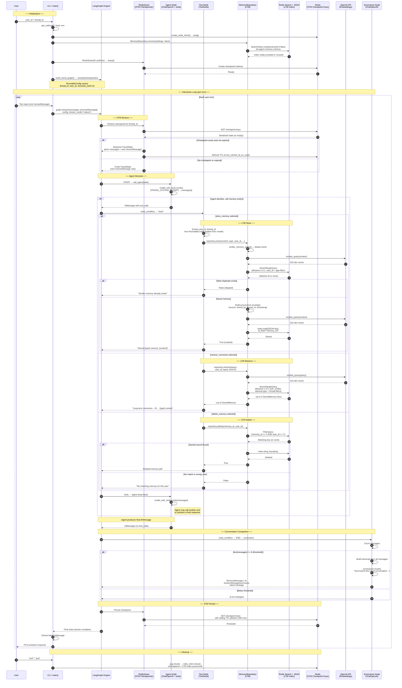

# Memory Travel Assistant — End-to-End Request Flow

```mermaid
sequenceDiagram
    autonumber

    participant User
    participant CLI as CLI / main()
    participant Graph as LangGraph Engine
    participant Saver as RedisSaver<br/>(STM Checkpointer)
    participant Agent as Agent Node<br/>(ChatOpenAI + tools)
    participant ToolNode as Tool Node<br/>(ToolNode)
    participant Repo as MemoryRepository<br/>(LTM)
    participant RedisLTM as Redis Search + JSON<br/>(LTM Index)
    participant RedisSTM as Redis<br/>(STM Checkpoint Keys)
    participant OpenAI as OpenAI API<br/>(Embeddings)
    participant Summarizer as Summarize Node<br/>(ChatOpenAI)

    Note over User,CLI: ── Initialization ──

    User ->> CLI: user_id + thread_id
    CLI ->> CLI: get_settings() / load .env
    CLI ->> RedisSTM: create_redis_client() → ping()

    CLI ->> Repo: MemoryRepository.connect(settings, client)
    Repo ->> RedisLTM: SearchIndex.create(overwrite=False)<br/>idx:agent-memory schema
    RedisLTM -->> Repo: Index ready (created or reused)

    CLI ->> Saver: RedisSaver(ttl, prefixes) → setup()
    Saver ->> RedisSTM: Create checkpoint indexes
    RedisSTM -->> Saver: Ready

    CLI ->> Graph: build_travel_graph() → compile(checkpointer)
    Note over CLI,Graph: RunnableConfig carries<br/>thread_id, user_id, recursion_limit=12

    Note over User,Summarizer: ── Interactive Loop (per turn) ──

    loop Each user turn
        User ->> CLI: Text input (one HumanMessage)

        CLI ->> Graph: graph.stream({messages: [HumanMessage]},<br/>config, stream_mode="values")

        Note over Graph,Saver: ── STM Restore ──
        Graph ->> Saver: Restore checkpoint for thread_id
        Saver ->> RedisSTM: GET checkpoint keys
        RedisSTM -->> Saver: Serialized state (or empty)

        alt Checkpoint exists and not expired
            Saver -->> Graph: Restored TravelState<br/>(prior messages + new HumanMessage)
            Saver ->> RedisSTM: Refresh TTL (if stm_refresh_ttl_on_read)
        else No checkpoint or expired
            Saver -->> Graph: Fresh TravelState<br/>(new HumanMessage only)
        end

        Note over Graph,Agent: ── Agent Decision ──
        Graph ->> Agent: START → call_agent(state)
        Agent ->> Agent: model_with_tools.invoke(<br/>[TRAVEL_SYSTEM_PROMPT, ...messages])

        alt Agent decides: call memory tool(s)

            Agent -->> Graph: AIMessage with tool_calls
            Graph ->> ToolNode: tools_condition → "tools"

            alt store_memory selected
                Note over ToolNode,RedisLTM: ── LTM Store ──
                ToolNode ->> ToolNode: Extract user_id, thread_id<br/>from RunnableConfig (hidden from model)
                ToolNode ->> Repo: repository.store(content, type, user_id, ...)

                Repo ->> Repo: similar_memory_exists() — dedup check
                Repo ->> OpenAI: embed_query(content)
                OpenAI -->> Repo: 512-dim vector
                Repo ->> RedisLTM: VectorRangeQuery<br/>(distance ≤ 0.1, user_id + type filter)
                RedisLTM -->> Repo: Matches (0 or more)

                alt Near-duplicate exists
                    Repo -->> ToolNode: False (skipped)
                    ToolNode -->> Graph: "Similar memory already exists"
                else Novel memory
                    Repo ->> Repo: Build provenance envelope<br/>(source, stored_by, thread_id, timestamp)
                    Repo ->> OpenAI: embed_query(content)
                    OpenAI -->> Repo: 512-dim vector
                    Repo ->> RedisLTM: index.load([JSON doc],<br/>id_field="memory_id")
                    RedisLTM -->> Repo: Stored
                    Repo -->> ToolNode: True (created)
                    ToolNode -->> Graph: "Stored {type} memory: {content}"
                end

            else retrieve_memories selected
                Note over ToolNode,RedisLTM: ── LTM Retrieve ──
                ToolNode ->> Repo: repository.retrieve(query,<br/>user_id, types, limit=5)
                Repo ->> OpenAI: embed_query(query)
                OpenAI -->> Repo: 512-dim vector
                Repo ->> RedisLTM: VectorRangeQuery<br/>(distance ≤ 0.3, user_id filter,<br/>optional type + thread filters)
                RedisLTM -->> Repo: Up to 5 StoredMemory docs
                Repo -->> ToolNode: List of StoredMemory
                ToolNode -->> Graph: "Long-term memories: - ID ... [type] content"

            else delete_memory selected
                Note over ToolNode,RedisLTM: ── LTM Delete ──
                ToolNode ->> Repo: repository.delete(memory_id, user_id)
                Repo ->> RedisLTM: FilterQuery<br/>(memory_id == X AND user_id == Y)
                RedisLTM -->> Repo: Matching key (or none)

                alt Owned record found
                    Repo ->> RedisLTM: index.drop_keys(key)
                    RedisLTM -->> Repo: Deleted
                    Repo -->> ToolNode: True
                    ToolNode -->> Graph: "Deleted memory {id}"
                else No match or wrong user
                    Repo -->> ToolNode: False
                    ToolNode -->> Graph: "No matching memory for this user"
                end
            end

            Graph ->> Agent: tools → agent (loop back)
            Agent ->> Agent: model_with_tools.invoke(messages)

            Note right of Agent: Agent may call another tool<br/>or produce a final response
        end

        Note over Graph,Agent: Agent produces final AIMessage
        Agent -->> Graph: AIMessage (no tool_calls)

        Note over Graph,Summarizer: ── Conversation Compaction ──
        Graph ->> Summarizer: tools_condition → END → summarize
        Summarizer ->> Summarizer: Count messages

        alt len(messages) >= 6 (threshold)
            Summarizer ->> Summarizer: Build transcript from all messages
            Summarizer ->> Summarizer: summarizer.invoke(<br/>"Summarize this travel conversation...")
            Summarizer -->> Graph: RemoveMessage x N,<br/>SystemMessage(summary),<br/>latest message
        else Below threshold
            Summarizer -->> Graph: {} (no changes)
        end

        Note over Graph,RedisSTM: ── STM Persist ──
        Graph ->> Saver: Persist checkpoint
        Saver ->> RedisSTM: SET checkpoint keys<br/>with sliding TTL (default 1440 min)
        RedisSTM -->> Saver: Persisted

        Graph -->> CLI: Final state (stream complete)
        CLI ->> CLI: Extract latest AIMessage
        CLI -->> User: Print assistant response
    end

    Note over CLI,RedisSTM: ── Cleanup ──
    User ->> CLI: "exit" / "quit"
    CLI ->> RedisSTM: app.close() → redis_client.close()<br/>(checkpoints + LTM index preserved)
```
