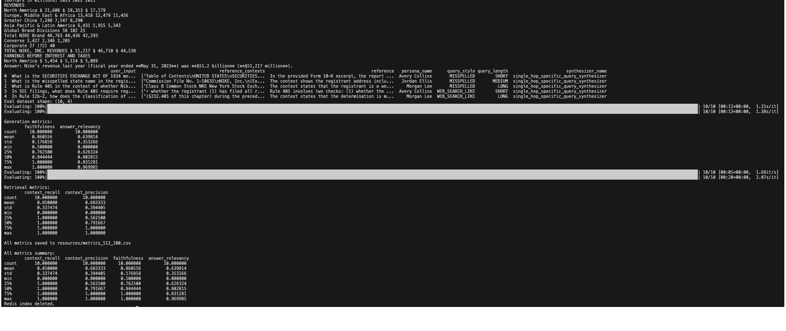

# Redis RAG Evaluation with Ragas & OpenAI Batch


An end-to-end evaluation workflow for a Redis-backed retrieval-augmented generation system.
It creates a synthetic testset from a financial filing, runs every question through the same
RAG application, and measures generation quality and retrieval quality separately with Ragas.

The defining evaluation contract is simple: **retrieve once for each testset row, generate from
those documents, and pass the identical documents to scoring**. This prevents a second retrieval
from silently changing the evidence between inference and evaluation.

This is a generic, demonstrational working primitive intended to showcase repeatable evaluation
of a Redis-backed RAG path. It is not intended or suitable for production use, model certification,
or release gating: the included corpus, synthetic questions, thresholds, metrics, manifests, and
judges exist to make evaluation mechanics reproducible and inspectable.

## Architecture Overview

| File                                                               | Responsibility                                                                                                                                                    |
| ------------------------------------------------------------------ | ----------------------------------------------------------------------------------------------------------------------------------------------------------------- |
| `generate_testset.py`                                              | Splits a PDF, submits document embeddings to OpenAI Batch, persists a resumable run manifest, collects complete or partial results, and generates a synthetic CSV |
| `06_ragas_evaluation.py`                                           | Builds a temporary Redis vector index, runs the retrieve-once RAG chain, calculates four Ragas metrics, writes per-row results, and performs scoped cleanup       |
| [`evaluation_sequence_diagram.md`](evaluation_sequence_diagram.md) | Mermaid sequence diagram covering Batch submission and collection, retrieve-once generation, Ragas scoring, artifact writes, and cleanup                          |
| `new_testset.csv`                                                  | Included ten-row synthetic testset using the current Ragas column schema                                                                                          |
| `.batch_state.json`                                                | Runtime-only, versioned manifest containing batch identity, source hash, exact chunks, models, generation settings, and collection attempts                       |
| `resources/nke-10k-2023.pdf`                                       | Source filing used for testset generation and evaluation ingestion                                                                                                |
| `resources/metrics_512_100.csv`                                    | Runtime evaluation output for the default chunk configuration                                                                                                     |

The state and metrics files are ignored by Git. The included testset remains available so the
evaluation can be run without submitting a new Batch job.

## Ende-to-end sequence Diagram

For the complete interaction between testset generation, OpenAI Batch, Redis retrieval,
answer generation, and Ragas scoring, see the
[`end-to-end evaluation sequence diagram`](evaluation_sequence_diagram.md).

## What the Batch workflow does

The OpenAI Batch job processes **document-chunk embeddings** through `/v1/embeddings`. It does
not batch GPT-based synthetic question generation or Ragas judging.

```text
PDF → exact saved chunks → OpenAI Batch embeddings → local embedding cache
                                                     ↓
                                   live GPT-5.6 Luna testset generation
                                                     ↓
                                           synthetic testset CSV
```

During collection, `CachedEmbeddings` serves document vectors from the downloaded Batch output.
If a document result is missing—or Ragas requests a new query embedding—the adapter calls the
live OpenAI embeddings API. Partial collection therefore remains complete, but it may move some
work back to synchronous API calls.

## What it demonstrates

- A decoupled `--submit` / `--collect` workflow for asynchronous embedding jobs.
- A versioned, atomic run manifest that preserves the exact submitted source chunks.
- Immediate partial collection after one status request.
- Live embedding fallback for unavailable Batch results.
- Single-hop synthetic question generation with GPT-5.6 Luna and Ragas.
- A temporary, namespaced Redis vector index over PDF chunks.
- Threshold-qualified retrieval with `k=4` and a `0.7` similarity score.
- Source filename and page metadata carried into numbered citations.
- Explicit untrusted-passage boundaries in the generation prompt.
- One retrieval per evaluation row, shared by answer generation and scoring.
- Generation and retrieval metrics written as row-level CSV output.
- `try` / `finally` cleanup for Redis resources, OpenAI clients, and temporary files.

## Key Design Decisions

- **Retrieve once** — the LCEL chain returns `input`, raw `context` documents, and `answer` in
  one payload. Generation formats those documents for the prompt; dataset construction extracts
  scoring contexts from the same objects.
- **Persist submission inputs** — collection rehydrates chunks and metadata from the state file
  instead of reloading and re-splitting a potentially changed PDF.
- **Hash the source** — the manifest records the source path and SHA-256 digest so a run can be
  associated with the exact input file.
- **Record every collection attempt** — complete configuration and outcome data are appended to
  `collections`, including partial mode, batch coverage, model names, test size, filtered chunk
  count, run configuration, output location, completion status, and errors.
- **Write artifacts atomically** — state JSON and output CSV are written to temporary files and
  moved into place, reducing the chance of a truncated artifact after interruption.
- **Bound polling without hiding stalls** — normal collection reports progress every 30 seconds,
  stops on terminal failure, and warns after ten unchanged polls. `--no-poll` performs one check
  and fails if the job is incomplete.
- **Make partial collection explicit** — `--partial` performs one status check, consumes any
  exposed output file, records Batch coverage, and uses live embedding fallback for the rest.
- **Keep Redis cleanup scoped** — the evaluator deletes only its configured Search index and
  owned documents before and after a run, including when generation or scoring fails.
- **Fail softly at metric-row level** — Ragas runs with `raise_exceptions=False`; individual
  judging failures can be represented in results without discarding the complete evaluation.

## Retrieve-once evaluation contract

```text
1. Read one testset question and reference answer
2. Invoke the Redis retriever exactly once
3. Preserve the returned LangChain Document objects as D
4. Format D with source/page citations and untrusted-content delimiters
5. Generate the answer from that formatted evidence
6. Return {input, answer, context: D}
7. Convert page_content from the same D into Ragas contexts
8. Score answer and retrieval against the reference
```

The evaluator also runs a separate, fixed revenue query as a pre-evaluation smoke check. That
diagnostic does not contribute rows to the Ragas dataset. The one-retrieval guarantee applies to
each testset row created by `create_evaluation_dataset()`.

## RAG application under evaluation

| Setting             | Default                                       |
| ------------------- | --------------------------------------------- |
| Source              | `resources/nke-10k-2023.pdf`                  |
| Testset             | `evaluation/new_testset.csv`                  |
| Chunking            | 512 characters with 100-character overlap     |
| Search index        | `{REDIS_NAMESPACE}:idx:ragas:evaluation`      |
| Document key prefix | `{REDIS_NAMESPACE}:ragas:evaluation:document` |
| Embedding model     | `text-embedding-3-small`                      |
| Generation model    | `gpt-5.6-luna`                                |
| Retrieval           | Top 4 passages with similarity score ≥ `0.7`  |
| Indexed metadata    | Source path and zero-based PDF page number    |
| Displayed citations | Source basename and one-based page number     |
| Ragas retry setting | `RunConfig(max_retries=1)`                    |
| Output              | `resources/metrics_512_100.csv`               |

Retrieved passages are presented as numbered evidence blocks:

```text
[1] nke-10k-2023.pdf, page 42
<untrusted_retrieved_passage>
...
</untrusted_retrieved_passage>
```

The model is instructed to answer only from this evidence, cite supporting blocks as `[1]`,
`[2]`, and so on, and state that it does not know when the passages are insufficient.

## Metrics

| Metric            | Evaluates  | Interpretation                                                                    |
| ----------------- | ---------- | --------------------------------------------------------------------------------- |
| Faithfulness      | Generation | Whether answer claims are supported by retrieved context                          |
| Answer relevancy  | Generation | Whether the response addresses the user's question                                |
| Context recall    | Retrieval  | Whether retrieved context covers the reference answer                             |
| Context precision | Retrieval  | Whether retrieved context is focused rather than dominated by irrelevant passages |

The four metrics are evaluated in separate Ragas calls and then combined into one output table.
The script prints descriptive summaries and saves row-level results; it does not enforce a
pass/fail threshold.

### Example console output



## Batch run manifest

Submission creates schema version `2` state containing:

| Section     | Persisted fields                                                                                                  |
| ----------- | ----------------------------------------------------------------------------------------------------------------- |
| Source      | PDF path and SHA-256 digest                                                                                       |
| Chunking    | Size, overlap, count, exact content, and original metadata                                                        |
| Models      | Embedding and generator model names                                                                               |
| Batch       | Job ID, input file ID, endpoint, completion window, and status                                                    |
| Generation  | Synthesizer, query distribution, minimum chunk length, retry/wait configuration, and exception policy             |
| Collections | Timestamped attempts with output path, requested size, coverage, partial/poll modes, outcome, and failure details |

The manifest contains extracted document text and remote file/job identifiers. Keep it private,
apply the same retention policy as the source document, and do not commit it. The repository's
`.gitignore` already excludes `evaluation/.batch_state*.json`.

## Run it

Prerequisites:

- Python 3.13 or later.
- [`uv`](https://docs.astral.sh/uv/) for the locked Python environment.
- A local Redis 8 instance with Search and JSON commands available.
- An OpenAI API key for embeddings, generation, and Ragas judging.
- The included Nike 10-K PDF, or another PDF supplied to the testset generator.

From the repository root:

The commands below use `uv` directly. `make setup`, `make doctor`, and `make verify` are optional
aliases. `make redis-start` is an optional Homebrew-oriented launcher for the already-installed
Redis server; you may use your normal service manager instead.

```bash
# Install the locked dependencies.
uv sync --locked

# Create local configuration, then add OPENAI_API_KEY to .env.
cp .env.example .env

# Optional: start Redis with the repository's Homebrew-oriented wrapper.
make redis-start

# Validate the runtime directly.
uv run portfolio-doctor
```

### Run with the included testset

The repository already contains `evaluation/new_testset.csv`, so the shortest evaluation path
is:

```bash
uv run python evaluation/06_ragas_evaluation.py
```

This path still makes live OpenAI calls for document and query embeddings, answer generation,
and all four Ragas metrics.

### Generate a new testset

Submit the document-chunk embedding job and return immediately:

```bash
uv run python evaluation/generate_testset.py --submit \
  --pdf resources/nke-10k-2023.pdf \
  --state evaluation/.batch_state.json
```

Later, poll until completion and generate ten single-hop samples:

```bash
uv run python evaluation/generate_testset.py --collect \
  --state evaluation/.batch_state.json \
  --out evaluation/new_testset.csv \
  --size 10
```

Check once and return an error when the job is not complete:

```bash
uv run python evaluation/generate_testset.py --collect \
  --state evaluation/.batch_state.json \
  --out evaluation/new_testset.csv \
  --size 10 \
  --no-poll
```

Collect immediately from any available output and synchronously embed missing content:

```bash
uv run python evaluation/generate_testset.py --collect \
  --state evaluation/.batch_state.json \
  --out evaluation/new_testset.csv \
  --size 10 \
  --partial
```

`--partial` does not guarantee that OpenAI has exposed a partial output file. When none is
available, collection continues with an empty cache and embeds the required content live.

The shared `.env` supports these settings:

| Variable                                        | Required | Default / behavior                                       |
| ----------------------------------------------- | -------- | -------------------------------------------------------- |
| `OPENAI_API_KEY`                                | Yes      | No default                                               |
| `OPENAI_MODEL`                                  | No       | `gpt-5.6-luna` for generation and judging                |
| `OPENAI_EMBEDDING_MODEL`                        | No       | `text-embedding-3-small`                                 |
| `REDIS_URL`                                     | No       | Takes precedence over individual Redis connection fields |
| `REDIS_HOST`, `REDIS_PORT`, `REDIS_DB`          | No       | `localhost`, `6379`, `0`                                 |
| `REDIS_USERNAME`, `REDIS_PASSWORD`, `REDIS_SSL` | No       | Optional authentication and TLS settings                 |
| `REDIS_NAMESPACE`                               | No       | `portfolio`                                              |

## Expected output

Submission reports the parsed chunk count, uploaded file ID, Batch ID, and state location:

```text
[submit] Loading PDF: resources/nke-10k-2023.pdf
[submit] Created ... chunks
[submit] JSONL batch file written (... requests)
[submit] Uploaded file: file-...
[submit] Batch created: batch-... (status: validating)
[submit] State saved to: evaluation/.batch_state.json
```

Collection reports Batch coverage and whether live fallback will be needed:

```text
[collect] Checking batch: batch-...
[collect] Status: completed (.../... completed, 0 failed)
[collect] Downloading results from file: file-...
[collect] Loaded .../... embeddings from batch results
[collect] Generating 10 synthetic test samples (single-hop)...
[collect] Testset saved to: evaluation/new_testset.csv (10 rows)
```

Evaluation prints ingestion details, a smoke-test answer, dataset shape, descriptive statistics,
and the output path. Metric values depend on the model, testset, and retrieval behavior:

```text
Done preprocessing. Created ... chunks from resources/nke-10k-2023.pdf
Answer: ...
Eval dataset shape: (10, 4)
Generation metrics:
...
Retrieval metrics:
...
All metrics saved to resources/metrics_512_100.csv
Redis evaluation index deleted.
```

## Reproducibility, trust, and limitations

Here, reproducibility means preserving enough local configuration and evidence flow to explain or
repeat the demonstration. It does not establish deterministic model behavior, statistical
validity, production representativeness, or trustworthiness of the evaluated system.

1. Synthetic questions and references are generated from the same filing later indexed for
   evaluation. This measures controlled RAG behavior, not performance on independent production
   traffic.
2. GPT-5.6 Luna is used for answer generation, synthetic testset generation, and LLM-based
   judging by default. Shared-model evaluation can introduce correlated bias.
3. The workflow records models and inputs but does not set a random seed or pin provider-side
   model snapshots, so reruns may produce different questions and scores.
4. The `0.7` retrieval threshold is an example default, not a calibrated acceptance threshold
   for every corpus.
5. `raise_exceptions=False` preserves the run when individual metric rows fail. Review missing
   or non-numeric scores before comparing aggregate results.
6. The report contains point estimates only. It does not calculate confidence intervals,
   latency, token usage, monetary cost, or statistical significance between configurations.
7. The evaluator uses private Ragas metric modules for compatibility with `evaluate()` in the
   pinned dependency range. Upgrading Ragas requires rerunning the quality gate.
8. The evaluator deletes its namespaced Redis index before and after every run. Concurrent runs
   using the same `REDIS_NAMESPACE` will interfere; use a unique namespace per run when needed.
9. Prompt delimiters reduce the risk of retrieved instructions influencing generation, but they
   are not a complete content-safety or prompt-injection defense.
10. The source PDF, run manifest, synthetic references, and metric output may contain sensitive
    document content. Apply appropriate access and retention controls.
11. Temporary local JSONL files and API clients are cleaned up, but successfully uploaded Batch
    input/output files are not deleted from the provider automatically. Manage those remote
    artifacts according to the required retention policy.

## Test it

The focused tests use in-memory fakes and do not contact Redis, OpenAI, or Ragas services:

```bash
uv run python -m unittest \
  tests.test_phase2_requirements.EvaluationRetrievalTests \
  tests.test_phase2_requirements.BatchCollectionTests -v
```

Run the repository-wide quality gate directly when local Redis is available:

```bash
uv run ruff check .
uv run python -m unittest discover -s tests -v
uv run python -m compileall -q src RAG agentic evaluation llm_message_history semantic_cache vector_search workbench
```

`make verify` is the optional convenience alias for these commands.
Full OpenAI Batch and Ragas runs stay intentional because their cost scales with the dataset. The
repository [test strategy](../TESTING.md) distinguishes these experiments from bounded automated
integration coverage.

## License

This project is available under the repository's [MIT License](../LICENSE).
