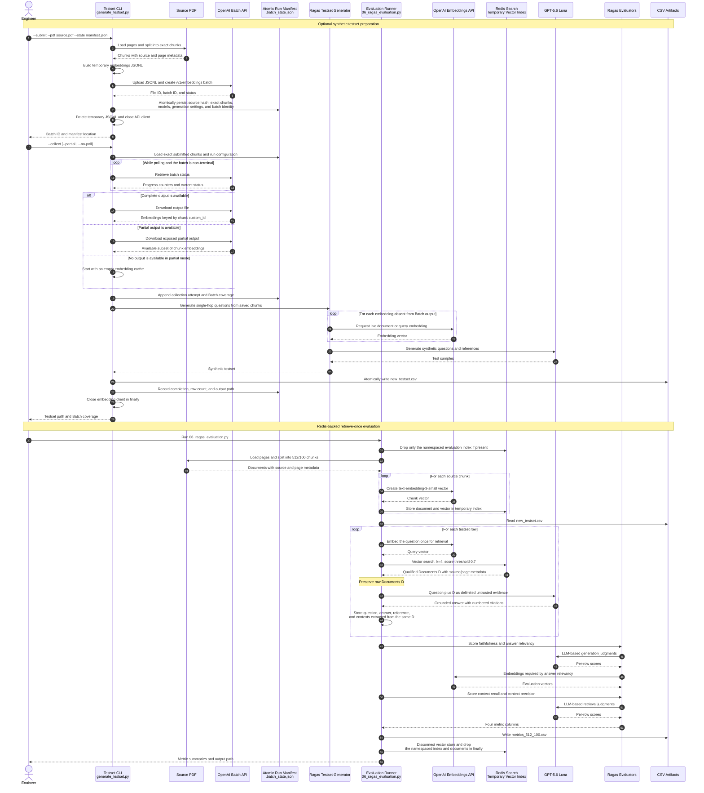

# Redis RAG Evaluation — End-to-End Sequence

This sequence shows the optional synthetic-testset workflow followed by the evaluation run.
The evaluation path retrieves once per question and reuses the same documents for generation
and Ragas scoring.

