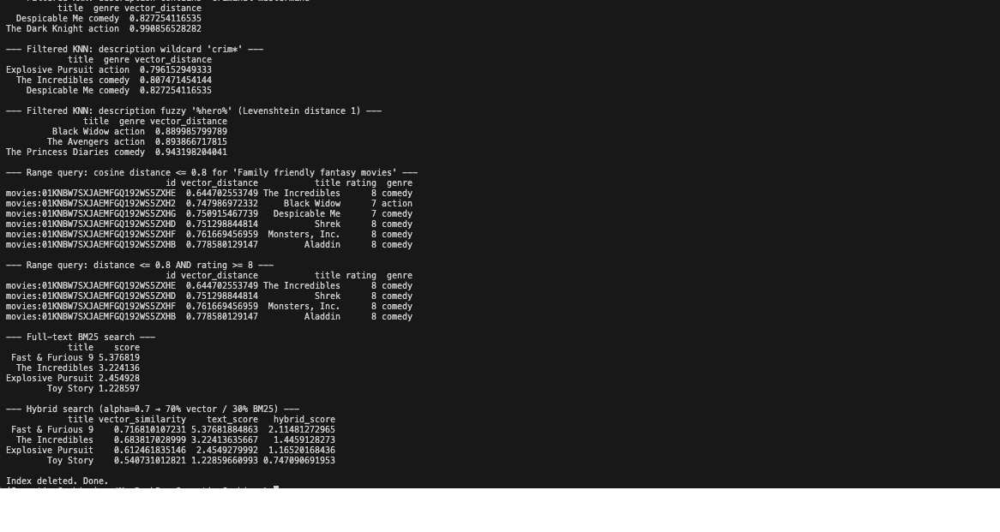

# Schema-First Vector and Hybrid Search with RedisVL


A schema-first Redis vector-search demonstration built with RedisVL. It loads a small movie
dataset through Pandas, generates local Sentence Transformer embeddings, reuses exact embeddings
through a Redis cache, and expresses Redis Search operations through typed query and filter
objects.

The example progresses from pure KNN to metadata-filtered KNN, vector ranges, BM25 text search,
and an aggregate-based lexical/vector score blend. It provides a direct comparison with the
lower-level [`redis-py` example](../1_redispy/README.md) while keeping the Redis index, query
semantics, cache lifecycle, and cleanup behavior visible.

This is a generic, demonstrational working primitive intended to showcase RedisVL abstractions over
Redis vector, filtered, lexical, and hybrid search. It is not intended or suitable for production
use: the small dataset, fixed schema, local model, example cache TTL, thresholds, and teardown
policy prioritize clarity over durable service design and validated relevance.

## Architecture Overview

| Component                                                    | Responsibility                                                                                       |
| ------------------------------------------------------------ | ---------------------------------------------------------------------------------------------------- |
| `resources/movies.json`                                      | Supplies 20 movies with ID, title, genre, rating, and description                                    |
| Pandas `DataFrame`                                           | Provides a tabular ingestion shape and converts enriched rows to Redis records                       |
| `EmbeddingsCache`                                            | Stores exact content/model embedding results in Redis with a sliding 600-second TTL                  |
| `HFTextVectorizer`                                           | Runs `sentence-transformers/all-MiniLM-L6-v2` locally and integrates cache lookup/write behavior     |
| `IndexSchema`                                                | Declares Hash storage plus TEXT, TAG, NUMERIC, and 384-dimensional VECTOR fields                     |
| `SearchIndex`                                                | Creates, loads, queries, and deletes the namespaced Redis Search index                               |
| RedisVL filter DSL                                           | Builds exact TAG, numeric-range, full-text, wildcard, and fuzzy pre-filters                          |
| RedisVL query objects                                        | Execute KNN, range, BM25, and aggregate hybrid retrieval through one normalized result API           |
| [`redisvl_sequence_diagram.md`](redisvl_sequence_diagram.md) | Traces cache hits/misses, local embedding, index replacement, every query family, and scoped cleanup |

All executable behavior lives in [`Redisvl.py`](./Redisvl.py). Importing it loads shared
configuration and definitions but does not connect to Redis, load the dataset, initialize the
local model, or create an index.

### End-to-end flow sequence diagram

For the complete interaction among the runner, embedding cache, local model, RedisVL query
layer, and Redis Search, see the
[RedisVL vector-search sequence diagram](redisvl_sequence_diagram.md).

## What it demonstrates

- RedisVL `IndexSchema` construction from a Python dictionary.
- Redis Hash storage behind a typed `SearchIndex`.
- Exact `FLAT` search over 384-dimensional `FLOAT32` vectors with cosine distance.
- Local Hugging Face embeddings with no external model API.
- Batched embedding-cache reads and writes keyed by exact content plus model name.
- Sliding cache TTL refresh on successful reads.
- `VectorQuery` for KNN retrieval and typed pre-filter expressions.
- `RangeQuery` for maximum-distance retrieval with an optional numeric filter.
- `TextQuery` for BM25STD ranking and normalized result dictionaries.
- RedisVL 0.16 `AggregateHybridQuery` for an `FT.AGGREGATE`-based score blend.
- Pandas output shaping for readable comparisons.
- Clean index recreation and failure-safe deletion scoped to this example.
- Shared Redis pooling, bounded timeouts, limited retries, and deterministic client closure.

## What RedisVL adds

The corresponding raw `redis-py` example exposes field constructors, byte conversion, query
strings, and direct `FT.*` calls. RedisVL moves those responsibilities into reusable objects:

| Concern               | RedisVL abstraction                      | Result                                                              |
| --------------------- | ---------------------------------------- | ------------------------------------------------------------------- |
| Schema                | `IndexSchema`                            | One declarative index definition                                    |
| Index lifecycle       | `SearchIndex`                            | Create, load, query, and delete methods                             |
| Local embeddings      | `HFTextVectorizer`                       | Consistent list/buffer conversion and dimension discovery           |
| Exact embedding reuse | `EmbeddingsCache`                        | Batch cache lookup, TTL, and fail-open fallback                     |
| Filters               | `Tag`, `Num`, `Text`                     | Composable Redis query expressions                                  |
| Retrieval             | `VectorQuery`, `RangeQuery`, `TextQuery` | Typed query configuration and common result dictionaries            |
| Score blending        | `AggregateHybridQuery`                   | KNN, BM25STD, computed scores, and sorting in an aggregate pipeline |

RedisVL still executes Redis Search commands. It changes the application-facing construction and
result-processing layer; it does not move filtering or vector ranking out of Redis.

## Index and document model

| Setting                 | Value                                                                     |
| ----------------------- | ------------------------------------------------------------------------- |
| Search index            | `{REDIS_NAMESPACE}:idx:movies:redisvl`                                    |
| Hash prefix             | `{REDIS_NAMESPACE}:movie:redisvl`                                         |
| Default concrete prefix | `portfolio:movie:redisvl`                                                 |
| Key separator           | `:`                                                                       |
| Record identifiers      | RedisVL-generated ULIDs because `index.load()` receives no `id_field`     |
| Dataset size            | 20 movies                                                                 |
| Indexed genres          | `action`, `comedy`                                                        |
| Embedding model         | `sentence-transformers/all-MiniLM-L6-v2`                                  |
| Vector dimensions       | 384                                                                       |
| Vector representation   | `FLOAT32`; ingestion requests Redis-ready buffers                         |
| Vector algorithm        | `FLAT` exact search                                                       |
| Distance metric         | Cosine                                                                    |
| Storage type            | Redis Hash                                                                |
| Document retention      | Movie index and Hashes are deleted on ordinary success or handled failure |

The schema contains:

| Field         | Redis type         | Configuration and use                             |
| ------------- | ------------------ | ------------------------------------------------- |
| `title`       | `TEXT`             | Returned with result rows                         |
| `description` | `TEXT`             | Full-text filtering and BM25STD ranking           |
| `genre`       | `TAG SORTABLE`     | Exact filtering and projected metadata            |
| `rating`      | `NUMERIC SORTABLE` | Minimum-rating filtering and projected metadata   |
| `vector`      | `VECTOR FLAT`      | 384-dimension, `FLOAT32`, cosine KNN/range search |

The source dataset's `id` is stored in each Hash but is not indexed and is not used as the Redis
key. Re-running creates new ULIDs after the prior index documents have been removed.

## Embedding-cache contract

The vectorizer uses this cache namespace:

```text
{REDIS_NAMESPACE}:cache:embeddings:redisvl:{content-and-model-digest}
```

The cache is exact, not semantic. A hit requires the same serialized content and embedding model
name. Its lifecycle is separate from the movie index:

```text
description or query
        ↓
exact Redis cache lookup
   ├─ hit  → refresh TTL to 600 seconds → return embedding
   └─ miss → local MiniLM encoding → store embedding with TTL → return embedding
```

`embed_many()` retrieves cached descriptions in a batch, computes only the misses, and writes the
new vectors back in a batch. `as_buffer=True` converts description embeddings into Redis-ready
`FLOAT32` bytes for Hash ingestion. Individual query embeddings are returned as numeric lists;
RedisVL serializes those lists for the query parameter.

Cache lookup or write errors generate warnings and fall back to local computation. They do not
prevent the vector-search demonstration from continuing. Dropping the movie index does not clear
the cache, so repeat runs within the TTL window can reuse description and query embeddings.

Initializing `HFTextVectorizer` still loads the local model and performs its dimension check.
The cache avoids repeated content encoding; it does not eliminate model initialization.

## Query catalogue

The script executes these queries in order:

| Query                 | RedisVL construction                          | Effective behavior                                                                            |
| --------------------- | --------------------------------------------- | --------------------------------------------------------------------------------------------- |
| Standard KNN          | `VectorQuery(..., num_results=3)`             | Returns the three closest movies to `High tech and action packed movie`                       |
| Genre-filtered KNN    | `Tag("genre") == "action"`                    | Mutates the first vector query to search action records only                                  |
| Genre and rating KNN  | `Tag(...) & Num("rating") >= 7`               | Applies both filters before vector ranking                                                    |
| Text-filtered KNN     | `Text("description") % "criminal mastermind"` | Requires both description terms before KNN                                                    |
| Prefix-filtered KNN   | `Text("description") % "crim*"`               | Narrows the candidate set by description prefix                                               |
| Fuzzy-filtered KNN    | `Text("description") % "%hero%"`              | Allows Levenshtein distance 1 for the text term                                               |
| Vector range          | `RangeQuery(distance_threshold=0.8)`          | Returns at most ten movies within cosine distance `0.8`                                       |
| Filtered vector range | Range plus `Num("rating") >= 8`               | Requires both semantic distance and minimum rating                                            |
| Full-text ranking     | `TextQuery(..., text_scorer="BM25STD")`       | Builds an OR-token query, requests 20 rows, and prints the first four                         |
| Aggregate hybrid      | `AggregateHybridQuery(alpha=0.7)`             | Computes BM25, vector similarity, and a blended score for 20 KNN candidates, then prints four |

`VectorQuery` and `RangeQuery` return `vector_distance` when score output is enabled. Lower cosine
distance means a closer vector match. The example does not enable RedisVL's optional normalized
vector-distance output.

`TextQuery(stopwords=None)` disables RedisVL's client-side NLTK stopword removal. Redis Search's
index-level stopword behavior still applies. RedisVL tokenizes the supplied text, escapes it, and
joins the terms with OR before asking Redis to rank them with BM25STD.

### Example console output



## Aggregate hybrid scoring

This repository is locked to RedisVL `0.16.0`. In that version,
`AggregateHybridQuery` does **not** call the newer Redis 8.4 `FT.HYBRID` command. It builds one
Dialect 2 KNN expression inside `FT.AGGREGATE`, includes an optional OR-token text clause, and
computes three fields:

```text
vector_similarity = (2 - vector_distance) / 2
text_score         = BM25STD __score
hybrid_score       = 0.3 × text_score + 0.7 × vector_similarity
```

The resulting aggregate request sorts `hybrid_score` descending and keeps at most 20 rows. The
script then displays the first four with all three score components.

The `alpha=0.7` value is the vector coefficient; `1 - alpha` is the text coefficient. It should
not be interpreted as a guaranteed “70% semantic influence” because the raw BM25STD and
normalized vector-similarity values may have different distributions. Production weighting
requires relevance evaluation and score calibration.

This aggregate-based technique also differs from native `FT.HYBRID`, which runs explicit lexical
and vector legs and supports RRF or LINEAR fusion. The example demonstrates RedisVL 0.16's
aggregate scoring pattern, not that newer command.

## Lifecycle and cleanup

The movie index is intentionally ephemeral while the embedding cache is reusable:

1. Load the 20-row JSON dataset into Pandas.
2. Initialize the Redis-backed 600-second embedding cache and local vectorizer.
3. Reuse cached description embeddings and compute any misses.
4. Create the Search index with `overwrite=True, drop=True`, deleting only the previous index and
   documents under this schema.
5. Load the enriched records with generated ULID keys.
6. Execute the complete query catalogue.
7. Call `index.delete()`, which drops the index and its movie Hashes.
8. If any operation raises, `main()` attempts `FT.DROPINDEX ... DD` for the same index.
9. Close the shared Redis connection pool in `finally`.

Embedding-cache keys use a different prefix and remain until their sliding TTL expires. No
`FLUSHDB` or broad key cleanup is used. Concurrent runs with the same `REDIS_NAMESPACE` can still
replace or delete one another's movie index.

Index deletion and short-lived cache reuse make the demonstration repeatable; they are not a
production lifecycle covering migrations, invalidation governance, concurrency, backups, recovery,
or continuous availability.

## Run it

Prerequisites:

- Python 3.13 or later.
- [`uv`](https://docs.astral.sh/uv/) for the locked Python environment.
- A local Redis 8 instance with Search available.
- The included [`resources/movies.json`](../../resources/movies.json) dataset.
- Network access on first use if the Sentence Transformer model is not cached locally.

No OpenAI API key is required. Embeddings are generated on the local machine.

From the repository root:

The commands below use `uv` directly. `make setup`, `make doctor`, and `make verify` are optional
aliases. `make redis-start` is an optional Homebrew-oriented launcher for the already-installed
Redis server; you may use your normal service manager instead.

```bash
# Install the locked environment.
uv sync --locked

# Create local Redis configuration if required.
cp .env.example .env

# Optional: start Redis with the repository's Homebrew-oriented wrapper.
make redis-start

# Validate the runtime directly.
uv run portfolio-doctor

# Run the RedisVL demonstration.
uv run python vector_search/2_redisvl/Redisvl.py
```

Run the command from the repository root because the script resolves
`resources/movies.json` relative to the current working directory.

The shared `.env` settings used by this example are:

| Variable                                        | Required | Default / behavior                                       |
| ----------------------------------------------- | -------- | -------------------------------------------------------- |
| `REDIS_URL`                                     | No       | Takes precedence over individual Redis connection fields |
| `REDIS_HOST`, `REDIS_PORT`, `REDIS_DB`          | No       | `localhost`, `6379`, `0`                                 |
| `REDIS_USERNAME`, `REDIS_PASSWORD`, `REDIS_SSL` | No       | Optional authentication and TLS settings                 |
| `REDIS_NAMESPACE`                               | No       | `portfolio`                                              |

`OPENAI_MODEL` and `OPENAI_EMBEDDING_MODEL` do not affect this script.

## Expected output

Exact rankings depend on the local model and dataset, while the output shape remains stable:

```text
Connected to Redis.

Loaded 20 movie entries.
Embedded 20 descriptions.

Index 'portfolio:idx:movies:redisvl' created.
Loaded 20 records into index.

--- Standard KNN vector search (top 3) ---
                         id                 title  genre vector_distance
...

--- Full-text BM25 search ---
                 title    score
...

--- Hybrid search (alpha=0.7 → 70% vector / 30% BM25) ---
                 title vector_similarity text_score hybrid_score
...

Index deleted. Done.
```

The `id` shown in result frames is the generated Redis key. A second run may show different IDs
even when the dataset and ranking are unchanged.

## Scope and limitations

Passing the runnable example and real-Redis integration test proves the illustrated RedisVL
boundary works. It does not establish that its schema, ranking, cache, or lifecycle is suitable for
a production workload.

1. The 20-movie, two-genre dataset demonstrates API behavior, not retrieval quality,
   representative latency, or scalability.
2. `FLAT` exact search is appropriate for this corpus. Larger deployments should compare HNSW
   recall, latency, build time, and memory against workload targets.
3. The `0.8` range threshold is illustrative and broad. Calibrate it with labeled queries and
   false-positive costs.
4. The embedding cache contains original text, model identity, and vector values. Apply an
   appropriate retention and access policy before caching sensitive content.
5. Cache TTL refreshes on read, so frequently reused entries can remain longer than 600 seconds
   from their original creation time.
6. Embedding-cache failures fail open to local computation. The script reports neither hit rate
   nor latency savings, so cache effectiveness is not measured.
7. `AggregateHybridQuery` combines score values with different scales. Its alpha coefficients
   require evaluation; they are not calibrated probabilities or correctness guarantees.
8. This code does not exercise native `FT.HYBRID`, RRF fusion, reranking, pagination, index
   aliases, durable serving, incremental updates, or explicit cache invalidation.
9. Record keys are generated ULIDs rather than source IDs. Stable upserts would require passing
   an `id_field` or explicit keys to `index.load()`.
10. The script recreates and deletes the index on every run. Concurrent processes sharing the
    same namespace will interfere, and a forced termination can leave the owned index behind for
    the next run to replace.
11. There is no dedicated relevance testset or benchmark. Printed tables are observational
    examples, not assertions.

## Test it

Validate imports and syntax without initializing the model or contacting Redis:

```bash
uv run python -m compileall -q vector_search/2_redisvl
```

Run the dedicated integration test against real Redis Search. It substitutes only deterministic
embeddings and executes RedisVL ingestion, KNN, TAG/numeric/text filters, range, BM25, hybrid
scoring, serialization, and cleanup:

```bash
uv run python -m unittest \
  tests.test_vector_search_redis.VectorSearchRedisIntegrationTests.test_redisvl_example_executes_real_vector_text_and_hybrid_queries -v
```

Run the repository-wide quality gate directly with the local Redis service available:

```bash
uv run ruff check .
uv run python -m unittest discover -s tests -v
uv run python -m compileall -q src RAG agentic evaluation llm_message_history semantic_cache vector_search workbench
```

`make verify` is the optional convenience alias for these commands.

The live command is the end-to-end integration check. It initializes the model and cache, creates
and queries the Redis index, and completes with scoped cleanup.

See the repository [test strategy](../../TESTING.md) for the fast/Redis/live boundary.

## License

This project is available under the repository's [MIT License](../../LICENSE).
