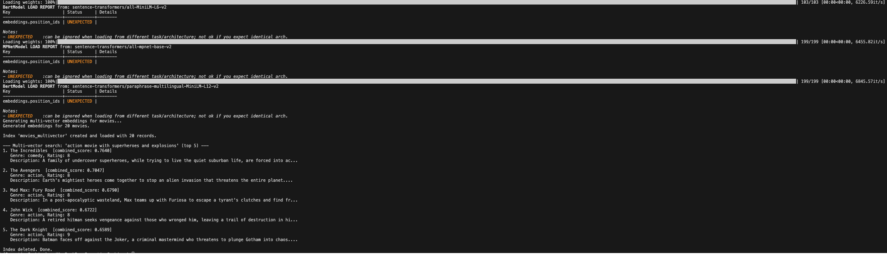

# Weighted Multi-Model Retrieval with RedisVL


A RedisVL demonstration that represents every movie through three independent embedding views,
stores those vectors in one Redis Hash document, and ranks the corpus with one weighted
multi-vector query.

The example combines different models, dimensions, numeric types, and source-text treatments
without concatenating vectors or issuing three client-side searches. Redis evaluates three
vector-range clauses in a single `FT.AGGREGATE` pipeline, converts each cosine distance to a
normalized score, calculates a weighted `combined_score`, and returns the five highest-ranked
movies.

This is a generic, demonstrational working primitive intended to showcase Redis multi-vector
indexing and weighted score fusion. It is not intended or suitable for production use: the three
models, dimensions, weights, distance range, tiny corpus, and index lifecycle are illustrative
choices rather than a validated retrieval architecture or operating model.

## Architecture Overview

| Component                                                            | Responsibility                                                                                       |
| -------------------------------------------------------------------- | ---------------------------------------------------------------------------------------------------- |
| [`resources/movies.json`](../../resources/movies.json)               | Supplies 20 movies with ID, title, description, genre, and rating                                    |
| Three RedisVL `HFTextVectorizer` instances                           | Generate 384-, 768-, and 384-dimensional embeddings locally                                          |
| Three RedisVL `EmbeddingsCache` instances                            | Isolate exact embedding reuse by representation and model with a sliding 600-second TTL              |
| `IndexSchema`                                                        | Declares one Hash index with TEXT, TAG, NUMERIC, and three HNSW VECTOR fields                        |
| `SearchIndex`                                                        | Replaces, validates, loads, queries, and deletes the namespaced index                                |
| `Vector` objects                                                     | Bind each query embedding to its matching field, datatype, weight, and distance ceiling              |
| `MultiVectorQuery`                                                   | Builds one aggregate request that intersects vector ranges and computes the weighted score           |
| Redis Search                                                         | Evaluates cosine distances, applies score expressions, sorts candidates, and returns the top five    |
| [`multivector_sequence_diagram.md`](multivector_sequence_diagram.md) | Traces model initialization, exact-cache decisions, ingestion, Redis-side fusion, and scoped cleanup |

All executable behavior lives in
[`Multivector_search.py`](./Multivector_search.py). Importing the module loads configuration and
definitions but does not connect to Redis, initialize models, create indexes, or write data.

### End-to-End Flow Sequence Diagram

For the complete interaction among the runner, local models, model-specific caches, RedisVL, and
Redis Search, see the
[multi-vector retrieval sequence diagram](multivector_sequence_diagram.md).

## What It Demonstrates

- Multiple vector fields attached to the same Redis document.
- Independent embedding spaces with different dimensions and datatypes.
- Three local Sentence Transformer models without an external model API.
- Exact, model-aware Redis embedding caches with isolated namespaces.
- HNSW vector indexing with cosine distance across every vector field.
- Schema validation before RedisVL writes each record.
- Query embeddings encoded separately for their matching vector spaces.
- Per-field `VECTOR_RANGE` retrieval inside one `FT.AGGREGATE` request.
- Redis-side distance normalization and weighted score calculation.
- Scoped index replacement and cleanup without broad database deletion.
- Shared Redis pooling, bounded timeouts, limited retries, and deterministic client closure.

## What “Multi-Vector” Means Here

Each movie is represented by three vectors rather than one:

```text
movie Hash
├── description_vector_general  → MiniLM representation of description
├── description_vector_movie    → MPNet representation of description
└── description_vector_genre    → multilingual MiniLM representation of genre + description
```

The vectors remain independent. They are not padded, concatenated, averaged, or projected into a
shared dimension. At query time, the same natural-language query is embedded once by each model,
and each query vector is compared only with the document field created by that model.

RedisVL then combines the three per-field scores:

```text
three query embeddings
          ↓
three VECTOR_RANGE clauses joined with AND
          ↓
three cosine distances
          ↓
three normalized scores
          ↓
weighted combined_score
          ↓
top five documents
```

This is multi-representation vector fusion. It is not lexical/vector hybrid retrieval, and it
does not use Redis 8.4's `FT.HYBRID` command.

## Representation Matrix

| View             | Indexed content             | Local model                                                   | Dimensions | Redis datatype | Raw bytes per movie | Query weight |
| ---------------- | --------------------------- | ------------------------------------------------------------- | ---------- | -------------- | ------------------- | ------------ |
| General          | `description`               | `sentence-transformers/all-MiniLM-L6-v2`                      | 384        | `FLOAT64`      | 3,072               | `0.3`        |
| Description-rich | `description`               | `sentence-transformers/all-mpnet-base-v2`                     | 768        | `FLOAT32`      | 3,072               | `0.5`        |
| Genre-prefixed   | `genre + " " + description` | `sentence-transformers/paraphrase-multilingual-MiniLM-L12-v2` | 384        | `FLOAT32`      | 1,536               | `0.2`        |

The three vector payloads total 7,680 raw bytes per movie before Redis Hash, HNSW, key, and index
overhead. With the included 20-record dataset, that is 153,600 bytes of raw vector values.

“Description-rich” is an application role assigned to MPNet in this example; the model is not
fine-tuned on the included movie dataset. Likewise, the third view is genre-aware because its
indexed input is prefixed with the movie genre, not because its model has been trained on the
repository's genre labels. These are deliberately different representations whose usefulness
must be measured against relevance judgments before production use.

## Index and Document Model

| Setting                 | Value                                                                     |
| ----------------------- | ------------------------------------------------------------------------- |
| Search index            | `{REDIS_NAMESPACE}:idx:movies:multivector`                                |
| Hash prefix             | `{REDIS_NAMESPACE}:movie:multivector`                                     |
| Default concrete prefix | `portfolio:movie:multivector`                                             |
| Key separator           | `:`                                                                       |
| Record identifiers      | RedisVL-generated ULIDs because `index.load()` receives no `id_field`     |
| Dataset size            | 20 movies                                                                 |
| Storage type            | Redis Hash                                                                |
| Vector algorithm        | HNSW approximate search for all three fields                              |
| Distance metric         | Cosine for all three fields                                               |
| Load validation         | Enabled with `validate_on_load=True`                                      |
| Document retention      | Index and movie Hashes are deleted on ordinary success or handled failure |

The schema contains:

| Field                        | Redis type         | Configuration and use                                 |
| ---------------------------- | ------------------ | ----------------------------------------------------- |
| `title`                      | `TEXT`             | Returned with result rows                             |
| `description`                | `TEXT`             | Returned with result rows                             |
| `genre`                      | `TAG SORTABLE`     | Exact metadata representation and result projection   |
| `rating`                     | `NUMERIC SORTABLE` | Numeric metadata representation and result projection |
| `description_vector_general` | `VECTOR HNSW`      | 384 dimensions, `FLOAT64`, cosine distance            |
| `description_vector_movie`   | `VECTOR HNSW`      | 768 dimensions, `FLOAT32`, cosine distance            |
| `description_vector_genre`   | `VECTOR HNSW`      | 384 dimensions, `FLOAT32`, cosine distance            |

The source dataset's `id` remains in each stored Hash but is neither indexed nor used as the Redis
key. Re-running the script produces new ULIDs after the prior movie documents have been removed.

All three fields use cosine distance because RedisVL's `MultiVectorQuery` maps their distance
values through the same score expression. Different dimensions and datatypes are valid because
each vector is searched only against its matching field; dimensions and datatypes must still
match within each field/query pair.

## Embedding-Cache Contract

Each vectorizer receives a separate exact cache:

| View             | Cache key prefix                                          |
| ---------------- | --------------------------------------------------------- |
| General          | `{REDIS_NAMESPACE}:cache:embeddings:multivector:general:` |
| Description-rich | `{REDIS_NAMESPACE}:cache:embeddings:multivector:movie:`   |
| Genre-prefixed   | `{REDIS_NAMESPACE}:cache:embeddings:multivector:genre:`   |

RedisVL appends a deterministic digest of the exact content and model name to each prefix. A
cache hit therefore requires the same serialized input and model; the cache does not perform
semantic matching.

Every successful read refreshes that entry's TTL to 600 seconds. A miss runs the associated local
model, stores the numeric embedding in the correct cache, applies the TTL, and converts the result
to the vectorizer's configured byte representation when `as_buffer=True` is requested.

The script calls `embed()` separately for each representation of each movie. Its ingestion stage
therefore performs 60 sequential cache decisions, followed by three more for the query. It does
not use RedisVL's batch embedding API. Cache read or write failures are logged and fail open to
local embedding so the retrieval example can continue.

Model construction still loads all three Sentence Transformer models and performs one dimension
check per model. Cached content avoids repeated encoding; it does not avoid model initialization.
The three cache namespaces survive movie-index deletion and expire independently after their most
recent successful access.

## Query and Scoring Contract

The example searches for:

```text
action movie with superheroes and explosions
```

It embeds that text with all three models and creates three `Vector` objects. The declared dtype
for each query vector matches its indexed field. No explicit `max_distance` is supplied, so
RedisVL 0.16 uses its default cosine-distance ceiling of `2.0` for every vector.

The resulting request is conceptually equivalent to:

```text
FT.AGGREGATE portfolio:idx:movies:multivector
  "@description_vector_general:[VECTOR_RANGE 2.0 $vector_0]
   AND @description_vector_movie:[VECTOR_RANGE 2.0 $vector_1]
   AND @description_vector_genre:[VECTOR_RANGE 2.0 $vector_2]"
  LOAD title description genre rating
  APPLY "(2 - @distance_0) / 2" AS score_0
  APPLY "(2 - @distance_1) / 2" AS score_1
  APPLY "(2 - @distance_2) / 2" AS score_2
  APPLY "@score_0 * 0.3 + @score_1 * 0.5 + @score_2 * 0.2" AS combined_score
  SORTBY @combined_score DESC MAX 5
  DIALECT 2
```

RedisVL binds the three binary vectors as runtime parameters. Each clause yields a raw cosine
distance, then Redis applies:

```text
score_i = (2 - distance_i) / 2

combined_score = 0.3 × score_0
               + 0.5 × score_1
               + 0.2 × score_2
```

Lower `distance_i` is closer; higher `score_i` and `combined_score` are better. A distance of `0`
maps to `1`, while the maximum accepted distance of `2` maps to `0`.

The three range clauses are joined with `AND`, so a document must satisfy every field's distance
ceiling. The default ceiling of `2.0` is deliberately broad for cosine distance. Production
systems can set `Vector.max_distance` independently for each representation to prevent a weak
view from contributing noisy candidates.

RedisVL 0.16 does not normalize the supplied weights. This example's values already sum to `1.0`;
changing them without preserving the intended scale changes the magnitude of `combined_score`.
Even when weights sum to one, they express an assumed preference rather than measured relevance.
Calibrate them with labeled queries and ranking metrics.

### Example console output



## Execution Lifecycle

The movie index is ephemeral while the embedding caches are reusable:

1. Load the 20 movies from the repository's JSON dataset.
2. Initialize three exact caches and three local vectorizers.
3. Generate or reuse three embeddings for every movie.
4. Create the Search index with `overwrite=True, drop=True`, replacing only the previous index and
   its indexed movie documents.
5. Load validated records under RedisVL-generated ULID keys.
6. Generate or reuse the three query embeddings.
7. Execute one `MultiVectorQuery` and print the top five blended results.
8. Call `index.delete()` to drop the movie index and its Hashes.
9. If an operation fails, attempt `FT.DROPINDEX ... DD` for the same namespaced index and re-raise
   the original error.
10. Close the shared Redis connection pool in `finally`.

The script never calls `FLUSHDB`, scans unrelated keys, or deletes the embedding caches. Concurrent
runs that share a `REDIS_NAMESPACE` can still replace or remove one another's movie index.

This controlled lifecycle makes Redis-side fusion easy to reproduce, but it does not address
production migrations, concurrent ingestion, cache governance, recovery, capacity planning, or
high availability.

## Run It

Prerequisites:

- Python 3.13 or later.
- [`uv`](https://docs.astral.sh/uv/) for the locked Python environment.
- A local Redis 8 instance with Search available.
- The included [`resources/movies.json`](../../resources/movies.json) dataset.
- Network access on first use if any Sentence Transformer model is not cached locally.
- Enough local memory to load all three embedding models in one Python process.

No OpenAI API key is required. Every embedding is generated on the local machine.

From the repository root:

The commands below use `uv` directly. `make setup`, `make doctor`, and `make verify` are optional
aliases. `make redis-start` is an optional Homebrew-oriented launcher for the already-installed
Redis server; you may use your normal service manager instead.

```bash
# Install the locked environment.
uv sync --locked

# Create local Redis configuration if required.
cp .env.example .env

# Optional: start Redis with the repository's Homebrew-oriented wrapper.
make redis-start

# Validate the runtime directly.
uv run portfolio-doctor

# Run the multi-vector demonstration.
uv run python vector_search/3_multivector_search/Multivector_search.py
```

Run the command from the repository root because the script resolves
`resources/movies.json` relative to the current working directory.

The shared `.env` settings used by this example are:

| Variable                                        | Required | Default / behavior                                       |
| ----------------------------------------------- | -------- | -------------------------------------------------------- |
| `REDIS_URL`                                     | No       | Takes precedence over individual Redis connection fields |
| `REDIS_HOST`, `REDIS_PORT`, `REDIS_DB`          | No       | `localhost`, `6379`, `0`                                 |
| `REDIS_USERNAME`, `REDIS_PASSWORD`, `REDIS_SSL` | No       | Optional authentication and TLS settings                 |
| `REDIS_NAMESPACE`                               | No       | `portfolio`                                              |

`OPENAI_MODEL` and `OPENAI_EMBEDDING_MODEL` do not affect this script.

## Expected Output

Exact rankings depend on the local model versions and dataset, while the console structure remains
stable:

```text
Connected to Redis.

Loaded 20 movies.
Generating multi-vector embeddings for movies...
Generated embeddings for 20 movies.

Index 'portfolio:idx:movies:multivector' created and loaded with 20 records.

--- Multi-vector search: 'action movie with superheroes and explosions' (top 5) ---
1. <movie title>  [combined_score: <score>]
   Genre: <genre>, Rating: <rating>
   Description: <first 100 characters>...

...

Index deleted. Done.
```

## Design Trade-offs and Extensions

This is a compact working retrieval primitive rather than a production benchmark or deployable
service. Successful execution demonstrates the Redis mechanism, not ranking quality, scalability,
reliability, or production suitability:

- HNSW is appropriate for larger, latency-sensitive corpora, but 20 records are too few to
  characterize approximate-search recall or performance.
- Three models increase initialization time, memory use, embedding work, stored vector bytes, and
  HNSW overhead. Each representation should earn its cost through evaluation.
- The script embeds records one at a time for clarity. Production ingestion should batch by model
  and pipeline writes at an appropriate size.
- The `0.3 / 0.5 / 0.2` weights are illustrative and are not calibrated against labeled relevance
  judgments.
- A broad `max_distance=2.0` provides no meaningful false-match guard. Tune per-field thresholds
  with positive and hard-negative examples.
- Score fusion cannot fix a representation that is systematically irrelevant. Compare single-view
  baselines, multi-view ablations, and fused rankings before rollout.

Useful next experiments include metadata pre-filters, per-vector distance ceilings, alternative
weights, reciprocal-rank fusion outside this RedisVL abstraction, deterministic document IDs,
batched embedding, and evaluation with recall@K, MRR, or NDCG.

## Verification

Run the dedicated integration test against real Redis Search. It substitutes only deterministic
vectors with the example's three dimensions/dtypes and executes the HNSW schemas, Hash
serialization, weighted `MultiVectorQuery`, result parsing, and scoped cleanup:

```bash
uv run python -m unittest \
  tests.test_vector_search_redis.VectorSearchRedisIntegrationTests.test_multivector_example_executes_real_weighted_redis_query -v
```

Run the repository checks directly from the root:

```bash
uv run ruff check .
uv run python -m unittest discover -s tests -v
uv run python -m compileall -q src RAG agentic evaluation llm_message_history semantic_cache vector_search workbench
```

`make verify` is the optional convenience alias for these commands.

See the repository [test strategy](../../TESTING.md) for why model downloads are kept out of the
automated real-Redis boundary test.

To inspect the example's owned Redis state while adapting it, use targeted commands such as
`FT.INFO portfolio:idx:movies:multivector` and prefix-scoped `SCAN`; avoid `KEYS` and broad database
cleanup commands.

## License

This project is available under the repository's [MIT License](../../LICENSE).
